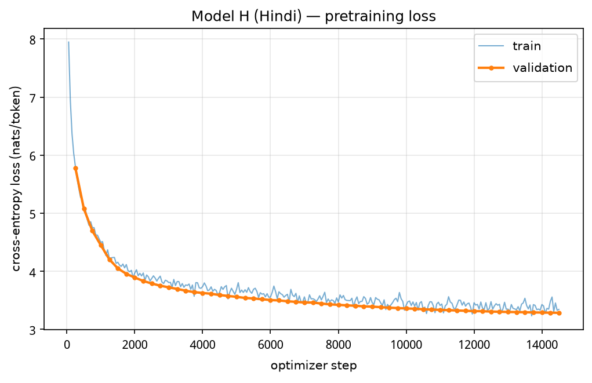
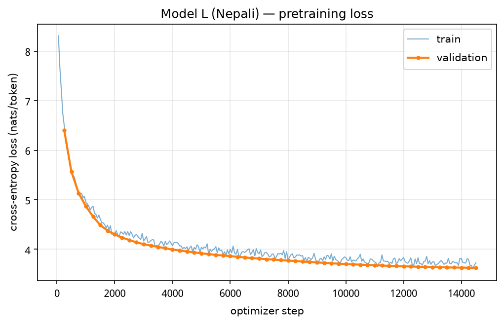
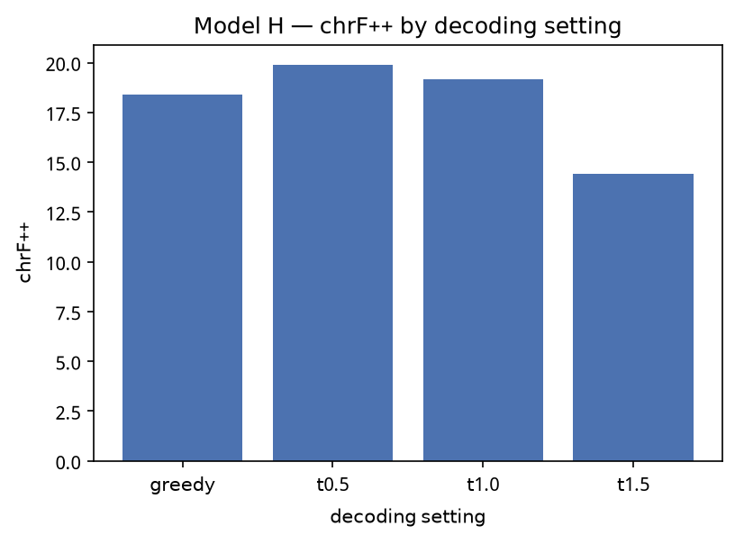
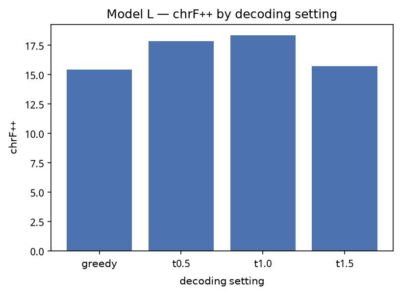
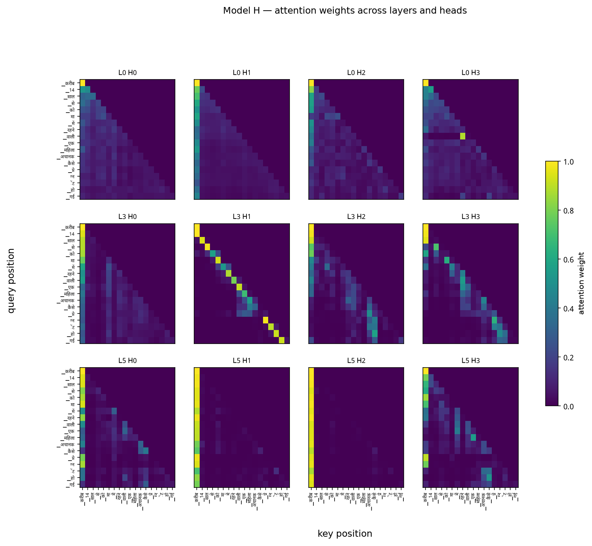
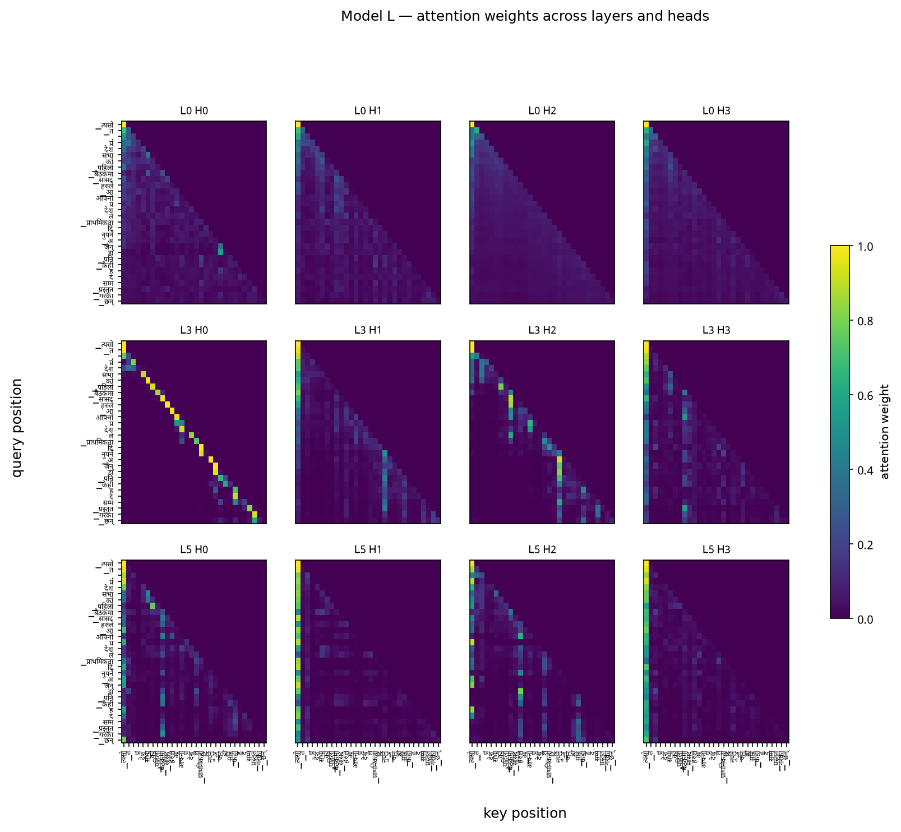
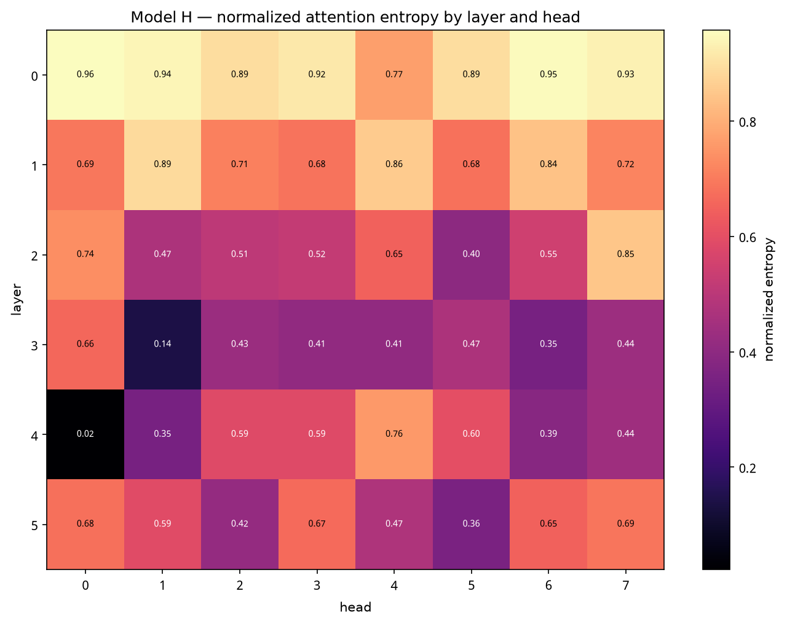
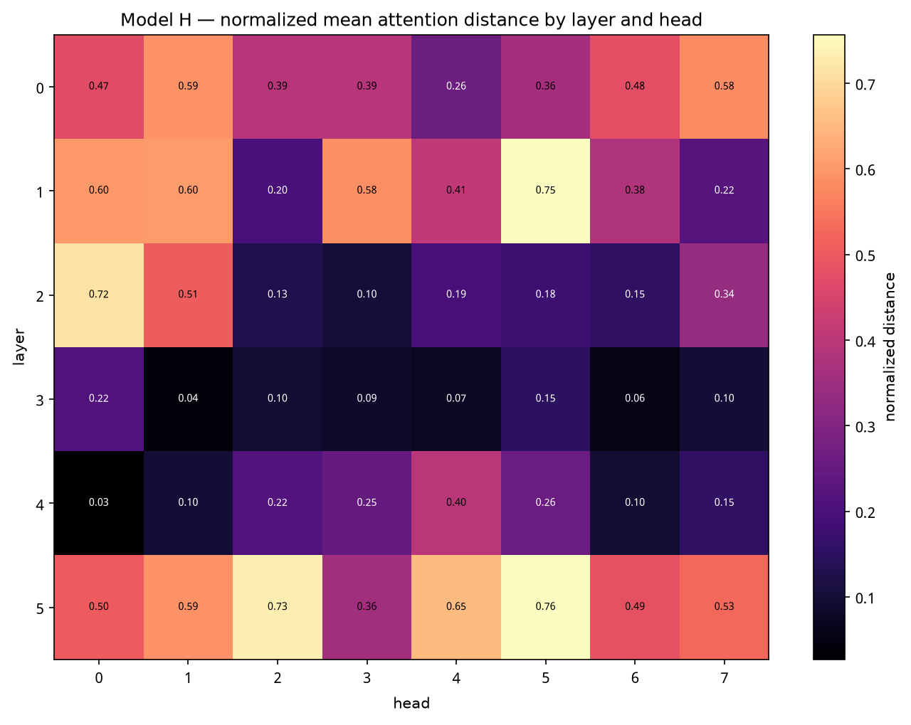
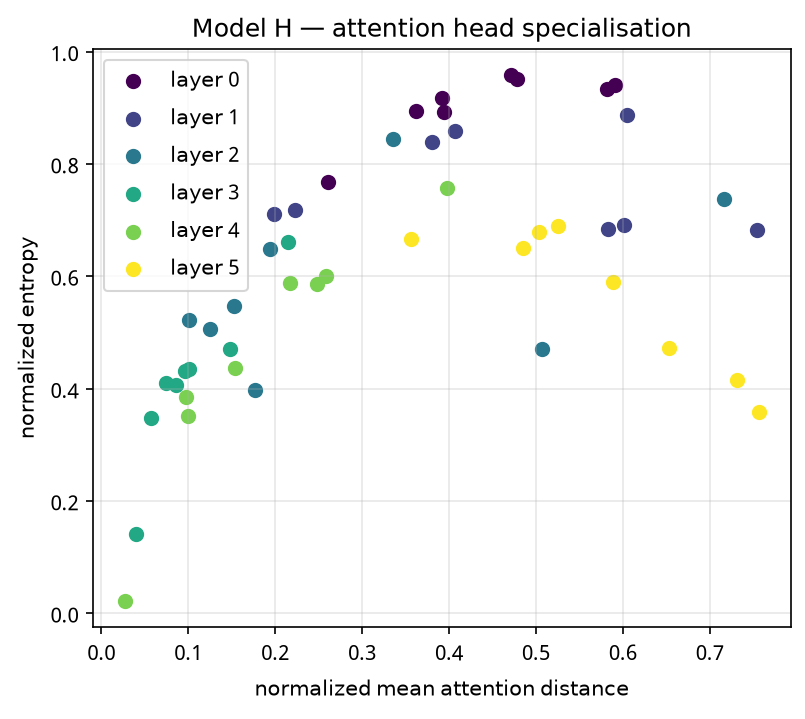
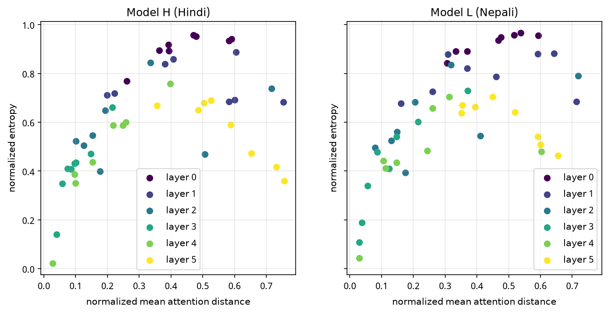

# Phase 2 — Model Implementation, Pretraining, and Evaluation

**Model H = Hindi (`hi`)  ·  Model L = Nepali (`ne`)**

Two decoder-only Transformers, written from PyTorch primitives, pretrained
independently on the corpora built in Phase 1. No data, tokenizer, vocabulary,
or weight is shared between them.

| | Model H (Hindi) | Model L (Nepali) |
|---|---:|---:|
| Trainable parameters | **24,285,184** | **24,285,184** |
| Training tokens seen | 475,136,000 | 475,136,000 |
| Validation loss / perplexity | 3.2733 / **26.40** | 3.6114 / **37.02** |
| Test loss / perplexity | 3.2719 / **26.36** | 3.6054 / **36.79** |
| **Bits per byte** | **0.5448** | **0.5018** |
| Unigram baseline perplexity | 1,355.2 | 2,419.0 |
| chrF++ (best decoding setting) | 19.90 (t=0.5) | 18.35 (t=1.0) |
| Wall clock (Tesla T4) | 193.8 min | 203.1 min |

Everything except the corpus was held identical between the two runs. The
headline result is that **Model L has 40% worse perplexity but *better*
bits-per-byte** — the two metrics disagree in direction, and §6 explains why
that is the most informative thing in this phase.

Sources: `hindi/eval/lm_eval.json`, `nepali/eval/lm_eval.json`,
`*/logs/train_log.csv`.

---

## 1. Architecture

### 1.1 The forward pass, stage by stage

Implemented in [`model/gpt.py`](../model/gpt.py) using only `nn.Linear`,
`nn.Embedding`, `nn.LayerNorm` and `nn.Dropout`. There is no `nn.Transformer*`,
no HuggingFace class, and deliberately no `F.scaled_dot_product_attention` — a
fused attention kernel is exactly the pre-built block the brief excludes, and
keeping the maths explicit is what makes the attention analysis in §5 possible.

For a batch of `B` sequences of length `T`:

| Stage | Operation | Shape |
|---|---|---|
| Input | token ids | `(B, T)` |
| Token embedding | lookup in a `10000 × 512` matrix | `(B, T, 512)` |
| Positional embedding | lookup in a `512 × 512` matrix, added | `(B, T, 512)` |
| Embedding dropout | p = 0.1 | `(B, T, 512)` |
| **× 6 blocks** | | |
| ⟶ LayerNorm | pre-norm, before the sublayer | `(B, T, 512)` |
| ⟶ Q, K, V | three `512 → 512` projections, no bias | `(B, T, 512)` each |
| ⟶ split heads | `view(B,T,8,64).transpose(1,2)` | `(B, 8, T, 64)` |
| ⟶ scores | `Q @ Kᵀ / √64` | `(B, 8, T, T)` |
| ⟶ causal mask | `masked_fill(~tril, -inf)` | `(B, 8, T, T)` |
| ⟶ softmax | over keys; each row sums to 1 | `(B, 8, T, T)` |
| ⟶ context | `attn @ V` | `(B, 8, T, 64)` |
| ⟶ merge heads | `transpose(1,2).view(B,T,512)` | `(B, T, 512)` |
| ⟶ output projection + residual | `W_o`, then `x + …` | `(B, T, 512)` |
| ⟶ FFN sublayer | LayerNorm → `512→2048` → GELU → `2048→512`, residual | `(B, T, 512)` |
| Final LayerNorm | | `(B, T, 512)` |
| Output head | `512 → 10000`, tied to the token embedding | `(B, T, 10000)` |
| Loss | cross-entropy, logits at `t` against token `t+1` | scalar |

### 1.2 Design choices

**Learned absolute positional embeddings.** Self-attention is permutation
invariant, so position must be injected explicitly. Learned embeddings were
chosen over sinusoidal (262K parameters is affordable, and learned positions fit
the data) and over RoPE (more complexity, and the optional ablation "remove
positional information" becomes a clean one-flag change). The cost is a **hard
context cap at 512** — there is no embedding row for position 512 or beyond, and
`GPT.forward` raises a `ValueError` naming that cap rather than failing quietly.
`generate()` crops its context to the last 512 tokens for the same reason.

**Pre-norm.** LayerNorm sits *inside* the residual branch: `x + Attn(LN(x))`
rather than `LN(x + Attn(x))`. The residual path therefore carries an unmodified
signal from the embeddings to the final norm, and gradients reach layer 0 without
passing through a normalization at every hop. Post-norm at this depth needs a
carefully tuned warmup to avoid early divergence; pre-norm does not.

**Weight tying.** The output projection shares storage with the token embedding
(`tests/test_model.py` asserts they are the same tensor, not a copy). This saves
5,120,000 parameters — 21% of the budget — and couples the representation a
token has as input with the one it is scored by.

**1/√d_k scaling.** A query·key dot product is a sum of `d_k = 64` terms, so its
variance grows with `d_k`. Unscaled, the logits push softmax towards one-hot and
the gradient towards zero. Dividing by `√64 = 8` keeps score variance near 1.

**Masking before softmax.** The mask is applied to the scores, not the
probabilities, so the surviving weights renormalize to sum to 1. Using `-inf` is
safe here because the diagonal is always allowed — no row is ever fully masked,
so softmax cannot produce NaN.

**Dropout placement.** p = 0.1 on embeddings, on attention probabilities, and on
both sublayer outputs. Attention dropout is applied *after* the weights are
captured for analysis, so §5 measures the true distribution.

**Initialization.** `N(0, 0.02)` throughout, with `W_o` and the FFN output
projection scaled to `0.02/√(2 × 6)`. Each block writes twice into the residual
stream, so without this the stream's variance grows with depth.

### 1.3 Parameter budget

| Component | Formula | Count |
|---|---|---:|
| Token embedding | 10,000 × 512 | 5,120,000 |
| Positional embedding | 512 × 512 | 262,144 |
| Per block — Q, K, V, O | 4 × 512² (no bias) | 1,048,576 |
| Per block — FFN | (512·2048 + 2048) + (2048·512 + 512) | 2,099,712 |
| Per block — 2 × LayerNorm | 2 × (2 × 512) | 2,048 |
| **Per block** | | **3,150,336** |
| × 6 blocks | | 18,902,016 |
| Final LayerNorm | 2 × 512 | 1,024 |
| Output head | tied → counted once | 0 |
| **Total** | | **24,285,184** |

`model/config.py` computes this analytically from the config alone, and
`tests/test_model.py` asserts it equals the real `count_params(GPT(cfg))` — so a
silent architecture change is caught by the test suite rather than discovered
later.

**Why 6 × 512.** The embedding alone costs 5.12M (21% of a ~25M budget), leaving
~19M for the blocks. Six blocks at 3.15M each consume it almost exactly. Eight
layers would need 30.6M — over budget. Narrowing `d_ff` to 1536 would buy two
more layers but drops the FFN below the conventional 4× width, which costs more
capacity per layer than the extra depth returns at this scale.

**Both models have identical parameter counts** because both Phase 1
vocabularies came out at 10,000. That is convenient rather than planned, and it
makes the H/L comparison controlled down to the individual weight.

### 1.4 Code organisation and model independence

`model/`, `train/` and `eval/` are shared between the two languages; all data,
tokenizers, configs, checkpoints, logs and results are per-language. The brief's
independence requirement concerns **data, tokenizer, vocabulary and weights** —
none of which are shared here — and duplicating the implementation into two
directories would risk the copies silently drifting apart, which is a real
correctness hazard when the whole point is that the two runs are identical.

Independence is enforced rather than assumed: every run takes an explicit
`--lang`, and `eval/loader.py` refuses to pair a checkpoint with a mismatched
tokenizer, raising rather than silently evaluating a Hindi model with the Nepali
vocabulary.

### 1.5 Causal masking — empirical proof

The brief requires showing that the model cannot see the future. The test
perturbs one token and measures how far the change propagates
(`python -m tests.test_causal`):

```
 edit pos   max |d| before   |d| at pos   max |d| after
        1         0.00e+00     1.06e+00        8.60e-02
        2         0.00e+00     7.70e-01        5.00e-02
        3         0.00e+00     6.15e-01        3.73e-02
        4         0.00e+00     8.00e-01        3.23e-02
        5         0.00e+00     1.07e+00        4.48e-02
        6         0.00e+00     6.76e-01        4.54e-02
        7         0.00e+00     9.29e-01        2.74e-02
        8         0.00e+00     1.27e+00        3.54e-02
        9         0.00e+00     6.72e-01             nan

PASS: logits before the edited position are bit-identical (0.00e+00);
      the edited position and everything after it change, as they must.
```

`0.00e+00` is bit-identical, not "within tolerance". The `nan` at position 9 is
simply an empty maximum — nothing follows the last token.

A model that ignored its input entirely would also show zero change before the
edit, so the test additionally asserts that the logit *at* the edited position
does move. Two further tests check the attention matrix directly: every row sums
to 1, and every entry strictly above the diagonal is exactly `0.0`.

**Test suite: 43 tests passing** (`python -m pytest tests/ -q`), covering shapes,
attention properties, loss masking, parameter counts, generation, checkpoint
resume, and the positional ablation. `tests/test_metrics.py` adds 13 more but
requires `sacrebleu`, which is installed on the training machine rather than
locally.

---

## 2. Pretraining

### 2.1 Hyperparameters — identical for both models

| Setting | Value | Reason |
|---|---|---|
| Optimizer | AdamW, β = (0.9, 0.95), eps 1e-8 | β₂ = 0.95 suits noisy small-batch gradients |
| Weight decay | 0.1 on ≥2-D tensors only | decaying LayerNorm gains fights the normalization |
| Peak learning rate | 6e-4 | standard for ~25M at this batch size |
| Schedule | 500-step linear warmup → cosine → 6e-5 | warmup avoids the early loss spike from AdamW's unreliable second moment |
| Gradient clipping | 1.0 global norm, after unscaling | |
| Micro-batch × accumulation | 16 × 4 = 64 sequences | |
| Tokens per step | 64 × 512 = 32,768 | |
| Total steps | 14,500 | |
| Precision | fp16 autocast + GradScaler | see below |
| Seed | 1337 (torch, numpy, python, cuda) | |

**Token budget.** 14,500 × 32,768 = **475,136,000 tokens** for each model —
99.0% of one epoch over the Hindi corpus and 97.6% over the Nepali one. Giving
both runs the same *step* count rather than the same *epoch* count is deliberate:
it means neither model was trained longer than the other, so every difference in
§6 is attributable to the data rather than the compute.

**Precision — a bug worth recording.** `torch.cuda.is_bf16_supported()` returns
`True` on a Tesla T4, which is Turing and has no bfloat16 tensor cores. The first
Hindi attempt therefore ran under *emulated* bf16 and was measurably slower
before this was caught. `train/trainer.py::pick_amp_dtype` now gates on compute
capability ≥ 8 (Ampere) instead of trusting that function, and falls back to
fp16 with a gradient scaler otherwise. Both reported runs used fp16.

### 2.2 Loss curves





Both curves fall from ≈9.2 — `ln(10000)`, uniform guessing over the vocabulary —
and flatten as the cosine schedule anneals. Validation loss sits slightly *below*
training loss throughout, which is expected rather than anomalous: dropout is
active during training and disabled during evaluation. The learning rate reached
its 6e-5 floor at step 14,500, so both runs completed their schedule rather than
being cut short.

`train_loss` in the log is the mean over the four accumulation micro-steps of
that optimizer step; a single micro-batch loss would be considerably noisier.

Sources: `hindi/logs/train_log.csv`, `nepali/logs/train_log.csv` (290 rows each).

### 2.3 Checkpointing and resume

The brief requires every checkpoint to carry model weights, optimizer state,
scheduler state, training step, and configuration. All five are present in
`train/checkpoint.py`, alongside the RNG state and data-stream position that
make a resumed run *identical* rather than merely similar:

```python
{"model", "optimizer", "scheduler", "scaler", "step", "tokens_seen",
 "config", "train_args", "data_state", "rng", "best_val", "format"}
```

The learning-rate schedule is a real object with `state_dict()` /
`load_state_dict()` rather than a function recomputed from the step count, so
there is a literal `scheduler` entry. Writes are atomic — `torch.save` to a
`.tmp` file followed by `os.replace` — because a session killed mid-save must
not destroy the only usable checkpoint.

**Resume equivalence, measured** (`python -m tests.test_resume`):

```
Checkpoint resume check
  uninterrupted run : 40 steps
  interrupted run   : 20 steps, saved, reloaded, 20 more

  step   uninterrupted      resumed    difference
     0        4.585584     4.585584      0.00e+00
    19        4.578818     4.578818      0.00e+00
    20        4.583013     4.583013      0.00e+00  <- resumed here
    39        4.575123     4.575123      0.00e+00

largest weight difference across all 40 steps: 0.00e+00
PASS: resuming reproduces the uninterrupted run exactly.
```

Dropout is deliberately left *on* in this test. It consumes the global RNG, so
the run only stays reproducible if the checkpoint's RNG state is restored
correctly — turning dropout off would make the test easier and weaker.

The data loader contributes the other half: windows are drawn in a seeded
permutation, so `(seed, step)` determines a batch exactly and a resumed run
replays the identical stream.

### 2.4 Compute

| | Model H | Model L |
|---|---:|---:|
| GPU | Tesla T4 (16 GB, sm_75) | Tesla T4 |
| Wall clock | 193.8 min | 203.1 min |
| Throughput | 41,516 tok/s | 39,446 tok/s |
| Peak GPU memory | 3.78 GB | 3.78 GB |
| Achieved fp16 utilisation | ≈10.5% of peak | ≈10.0% of peak |

Model FLOPs utilisation is computed as `6ND × 1.13` (the 13% accounting for
attention) against the T4's 65 TFLOPS fp16 peak. ~10% is low, and the two causes
are worth stating plainly:

1. **The attention is hand-written**, not fused. That is a requirement of this
   assignment, not an oversight, but it costs throughput.
2. **Peak memory was 3.78 GB of 15.6 GB — only 24% of the card.** A larger
   micro-batch at the same effective batch size would have run substantially
   faster. Settings were kept identical across both runs for comparability, which
   was the right call once Hindi had started, but the inefficiency is real.

Both runs completed in a single Kaggle session without interruption, so the
resume path was exercised by `tests/test_resume.py` and by one deliberate
mid-run kill during development rather than by an actual crash.

---

## 3. Intrinsic evaluation

### 3.1 Results

| Metric | Model H (Hindi) | Model L (Nepali) |
|---|---:|---:|
| Validation cross-entropy | 3.2733 | 3.6114 |
| Validation perplexity | 26.40 | 37.02 |
| Test cross-entropy | 3.2719 | 3.6054 |
| **Test perplexity** | **26.36** | **36.79** |
| **Bits per byte** | **0.5448** | **0.5018** |
| Bytes per token | 8.39 | 10.24 |
| Unigram baseline perplexity | 1,355.2 | 2,419.0 |
| Improvement over unigram | **51×** | **66×** |

Source: `hindi/eval/lm_eval.json`, `nepali/eval/lm_eval.json`.

**Protocols.** Perplexity is measured over the *full* held-out split in
non-overlapping 512-token windows, teacher-forced, dropout off — the same shape
of computation as training, so it is directly comparable to the validation
numbers in the training log. Validation and test agree to within 0.2%, which is
what you want: the model is not overfit to the set that was checked every 250
steps during training.

Bits-per-byte is measured on a frozen 2,000-document subset of the test split
(`{lang}/data/eval/test_subset.jsonl`, fixed seed) using a sliding window of 512
with stride 256, so that every scored token beyond the first window has at least
256 tokens of real context. The `</s>` token is excluded from the nats sum
because it has no corresponding UTF-8 bytes.

**Caveat.** Perplexity and BPB are computed on different data — the full test
split versus the 2,000-document subset. Both are drawn from the same
distribution, so the comparison holds, but they are not two views of literally
the same tokens.

**The unigram baseline** is computed locally by counting token frequencies in
`train.bin` with a single `bincount` pass and scoring `test.bin` under that fixed
distribution. It converts "perplexity 26" from a bare number into evidence: both
models are roughly 50–66× better than a model that knows only word frequency.

### 3.2 Why perplexity is not comparable across the two models

Perplexity is per *token*, and the two tokenizers cut text differently. From
Phase 1: Hindi fertility 1.4675 tokens/word, Nepali 1.5881; Hindi 3.47
characters per token, Nepali 3.95. Nepali words are ~27% longer in characters,
so its tokens cover more text.

Measured here, a Nepali token carries **10.24 bytes** against Hindi's **8.39** —
22% more. A model predicting a Nepali token is therefore making a *harder*
prediction, covering more ground per step. Comparing raw perplexity between them
is comparing the difficulty of two different tasks.

Bits-per-byte fixes this by normalizing against a unit both models share:

```
BPB = (Σ nats / ln 2) / (Σ UTF-8 bytes of the same text)
```

### 3.3 The finding: the gap reverses

**Model L is 40% worse on perplexity but 8% better on bits-per-byte.**

| | Model H | Model L | L relative to H |
|---|---:|---:|---:|
| Test perplexity | 26.36 | 36.79 | **1.40× worse** |
| Test cross-entropy | 3.2719 | 3.6054 | 1.10× worse |
| Bytes per token | 8.39 | 10.24 | 1.22× more |
| Bits per byte | 0.5448 | 0.5018 | **0.92× — better** |

This can be verified two ways. Dividing test cross-entropy by
`ln 2 × bytes/token` predicts BPB of 0.563 (H) and 0.508 (L) — a ratio of 0.903,
close to the 0.921 measured directly on the subset. The reversal is not an
artifact of one measurement.

Expressed per character (Devanagari is 3 bytes per character in UTF-8), that is
**1.63 bits/char for Hindi and 1.51 for Nepali** — both plausible for a 24M model
and reassuringly not absurd in either direction.

**What this means.** Most of the perplexity gap is an artifact of tokenizer
fertility, not of model quality. Nepali's tokenizer produces fewer, longer
tokens, so each prediction is harder and perplexity rises — but per byte of
actual text, Model L compresses slightly *better* than Model H.

**This contradicts the prediction made before running.** The Phase 2 plan
predicted that L would be worse on perplexity and that the BPB gap would be
*narrower* — attributing part of the difference to fertility and the remainder to
data quality. The gap did not narrow; it inverted. On the evidence here, the
Phase 1 data disadvantages (smaller corpus, 7.98% vs 13.46% manual tokens,
flatter token distribution) do **not** show up as worse per-byte language
modelling.

Two honest caveats on how far to push that conclusion:

- Bits-per-byte and perplexity are not measured on identical token sets (§3.1).
- BPB rewards a tokenizer that packs more bytes per token, and Nepali's does. The
  metric corrects for fertility, but whether it *over*-corrects at this scale is
  not something a single pair of models can settle.

The defensible claim is the narrow one: **the raw perplexity gap substantially
overstates the quality gap between these two models**, and any comparison
reported only in perplexity would have been misleading.

---

## 4. Generation quality

### 4.1 Protocol

300 documents from each language's frozen test subset. Prefix = first 64 tokens,
reference = the next 64 tokens (the true continuation). The model generates 64
tokens under four decoding settings: greedy, and pure temperature sampling at
0.5, 1.0, and 1.5 — no top-k, so temperature is the only variable. Seeded per
setting for reproducibility. All 300 hypothesis/reference pairs per setting are
saved to `{lang}/eval/samples_{setting}.jsonl`.

### 4.2 Results

**Model H (Hindi)** — source: `hindi/eval/generation.json`

| Setting | BLEU-4 | chrF++ | ROUGE-L | Distinct-1 | Distinct-2 | rep-4 |
|---|---:|---:|---:|---:|---:|---:|
| greedy | 7.02 | 18.38 | 0.153 | 0.093 | 0.247 | 0.643 |
| t = 0.5 | **7.16** | **19.90** | **0.157** | 0.116 | 0.382 | 0.392 |
| t = 1.0 | 4.77 | 19.16 | 0.125 | 0.196 | 0.777 | 0.037 |
| t = 1.5 | 0.99 | 14.44 | 0.062 | 0.265 | 0.961 | 0.001 |

**Model L (Nepali)** — source: `nepali/eval/generation.json`

| Setting | BLEU-4 | chrF++ | ROUGE-L | Distinct-1 | Distinct-2 | rep-4 |
|---|---:|---:|---:|---:|---:|---:|
| greedy | 2.23 | 15.43 | 0.090 | 0.100 | 0.241 | 0.656 |
| t = 0.5 | **2.35** | 17.85 | **0.098** | 0.143 | 0.448 | 0.324 |
| t = 1.0 | 1.14 | **18.35** | 0.077 | 0.243 | 0.871 | 0.012 |
| t = 1.5 | 0.34 | 15.72 | 0.034 | 0.302 | 0.975 | 0.000 |




### 4.3 Why each metric is or is not informative here

**BLEU-4 — reported because required, but weak evidence.** It measures exact
4-gram precision against a *single* reference continuation. For open-ended
generation there are many valid continuations and the held-out one is just a
sample from them, so BLEU mostly measures luck. It also penalises Nepali
mechanically: longer, more agglutinative words make exact 4-gram matches rarer
regardless of quality, which is part of why Model L scores 2.35 against Model H's
7.16. Computed with sacrebleu's `intl` tokenizer, which splits Unicode
punctuation including the danda `।`; the default `13a` tokenizer is tuned for
European text and handles Devanagari poorly. The `spm`/`flores200` tokenizers
were **not** used, as those load a pretrained SentencePiece model.

**chrF++ — the metric to actually compare on.** Character n-gram F-score with
word order 2. Being character-level, it is script-agnostic and insensitive to how
the subword tokenizer happened to split a word, which is exactly the robustness
Devanagari needs. The H/L gap on chrF++ (19.90 vs 18.35, an 8% difference) is far
smaller than the BLEU gap (7.16 vs 2.35, a 3× difference) — and the chrF++ gap is
consistent with the bits-per-byte finding in §3.3, while the BLEU gap is not.

**ROUGE-L — implemented from scratch, and that was necessary.** The standard
`rouge_score` package tokenizes with a `[^a-z0-9]+` regex, which strips every
Devanagari character and silently returns 0.0 for every Hindi and Nepali pair.
`eval/metrics.py` implements LCS-based F1 over whitespace-split tokens instead,
and `tests/test_metrics.py` guards it by asserting that a Devanagari string
scored against itself returns exactly 1.0. It remains single-reference-limited
like BLEU, but is more forgiving of insertions.

**Distinct-n and repetition — degeneration, not accuracy.** These need no
reference. They diagnose whether the model is looping.

### 4.4 The temperature curve

Both models trace the classic U-shape, and it is unusually clean here:

- **Greedy** degenerates badly. rep-4 of 0.643 (H) and 0.656 (L) means roughly
  two thirds of generated 4-grams are repeats. Distinct-2 of ~0.24 says the same
  thing from the other side.
- **t = 0.5** roughly halves repetition and gives Hindi its best scores on all
  three reference-based metrics.
- **t = 1.0** almost eliminates repetition (rep-4 = 0.037 / 0.012) and gives
  Nepali its best chrF++.
- **t = 1.5** is maximally diverse (Distinct-2 ≈ 0.97) and incoherent — chrF++
  drops for both models and BLEU collapses to near zero.

**The two models peak at different temperatures** — Hindi at 0.5, Nepali at 1.0
on chrF++. Model L's next-token distribution is flatter (consistent with Phase 1:
top-1000 tokens cover 62.67% of the Nepali corpus against 72.52% for Hindi), so
it needs less temperature-sharpening to reach its best behaviour and tolerates
more sampling before losing coherence.

### 4.5 Qualitative samples

**Model H, greedy** — the failure mode is a clean loop.

> **Prefix:** अच्छी सेहत के लिए हड्डियों का मजबूत होना बेहद जरूरी होता है. हड्डियों को मजबूत रखने के लिए सही डाइट और न्यूट्रिशन लेना चाहिए…
>
> **Generated:** रखने के लिए हड्डियों का मजबूत होना जरूरी है. हड्डियों को मजबूत रखने के लिए हड्डियों का मजबूत होना जरूरी है. हड्डियों को मजबूत रखने के लिए हड्डियों का मजबूत होना जरूरी है…
>
> **Reference:** रखने के लिए हमें किन चीजों से बचना चाहिए और क्यों... जरूरत से ज्यादा नमक- अधिकतर लोग जानते हैं कि ज्यादा नमक खाने से सेहत को नुकसान पहुंचाता है…

The grammar is correct and the topic is right — it has clearly learned that this
is a health article about bones. But it has nothing further to say and cycles the
same clause. The reference moves on to specifics (salt, bread, cheese, chips);
the model cannot.

**Model L, t = 1.0** — coherent, fluent, and confidently wrong.

> **Prefix:** पश्चिम सेतीको जिम्मा लिएको चाइना थ्री गर्जेजसँग सन् २०१२ मा एमओयू भएको हो । त्यही अवस्थामा यो परियोजनाको जिम्मा बोर्डमा आएको हो…
>
> **Generated:** लाग्दो हो । तर उसका लागि लिने नै ठूलो हो । हामीले नोवेल र मेरी माउन्टेसको बाटोमा पनि ९० मेगावाट बिजुली उपलब्ध गराउनुपर्नेछ । नेपालका ड्रिम बेन्चमा २०७६ चैत १८ देखि अनिश्चितकालसम्म पुग्नेछ ।

At temperature 1.0 the loop is gone and the register is right — it produces
plausible Nepali energy-sector journalism, with correct sentence structure, a
sensible unit (९० मेगावाट, 90 megawatts), and a Bikram Sambat date (२०७६ चैत १८).
Every one of those facts is invented. This is the expected behaviour for a 24M
model: local fluency, correct morphology, and no factual grounding.

**What both models do well:** correct Devanagari, correct case marking and verb
agreement, plausible clause structure, and topical consistency with the prompt
for a sentence or two.

**What both models do badly:** they drift off topic, invent entities and numbers,
and at low temperature they loop. Neither is remotely a usable text generator,
which is the expected outcome for 24M parameters on 475M tokens — GPT-2 small was
5× larger on roughly 10× more text.

---

## 5. Attention analysis

Statistics are averaged over **64 held-out sequences of 256 tokens** each, giving
one row per (layer, head) — 48 cells per model. Aggregating rather than reading a
single sentence matters: per-sentence attention is noisy, and the specialisation
below is only visible in the average.

Sources: `hindi/eval/attention_stats.json`, `nepali/eval/attention_stats.json`.

### 5.1 Heatmaps




Layers 0, 3 and 5 × heads 0–3, on one held-out sentence, with Devanagari token
labels on both axes. Every panel is lower-triangular — the visual counterpart of
the causality proof in §1.5.

### 5.2 Per-layer statistics

**Model H (Hindi)**

| Layer | Norm. entropy | Norm. distance | Prev-token rate | Sink rate |
|---|---:|---:|---:|---:|
| 0 | 0.907 | 0.442 | 0.037 | 0.046 |
| 1 | 0.759 | 0.469 | 0.037 | 0.163 |
| 2 | 0.584 | 0.289 | 0.146 | 0.134 |
| 3 | **0.413** | **0.102** | **0.276** | 0.040 |
| 4 | 0.466 | 0.187 | 0.249 | 0.060 |
| 5 | 0.566 | 0.575 | 0.021 | **0.285** |
| **mean** | 0.616 | 0.344 | 0.128 | 0.121 |

**Model L (Nepali)**

| Layer | Norm. entropy | Norm. distance | Prev-token rate | Sink rate |
|---|---:|---:|---:|---:|
| 0 | 0.923 | 0.450 | 0.032 | 0.041 |
| 1 | 0.792 | 0.438 | 0.044 | 0.118 |
| 2 | 0.603 | 0.273 | 0.152 | 0.096 |
| 3 | **0.425** | **0.133** | **0.298** | 0.039 |
| 4 | 0.457 | 0.227 | 0.228 | 0.079 |
| 5 | 0.604 | 0.490 | 0.029 | 0.176 |
| **mean** | 0.634 | 0.335 | 0.131 | 0.091 |

Entropy is normalized by `ln(t+1)` and distance by `t`. This matters: row `t` of
a causal attention matrix can only spread over `t+1` keys, so raw entropy rises
with position for any head and is not by itself a specialisation signal. A
uniform head scores 1.0 normalized at every position; a sharply peaked head
approaches 0.




### 5.3 Head taxonomy



Three clear behaviours, and both models show all three:

**Diffuse early layers.** Layer 0 is nearly uniform (normalized entropy 0.907 H /
0.923 L) with no positional preference — it is averaging broadly over the context
rather than selecting from it.

**Local / previous-token heads in the middle.** Layers 3–4 are the sharpest part
of the network: lowest entropy (0.413 / 0.425 at layer 3), shortest distance
(0.102 / 0.133), and the highest previous-token rate (0.276 / 0.298). Individual
heads are extreme — Model H's layer 4 head 0 puts **96.3%** of its attention mass
on the immediately preceding token, and Model L's layer 4 head 2 puts 92.6%.
These are the induction-style heads that carry local morphology and agreement,
which for these two morphologically rich languages is exactly where you would
want capacity spent.

**Attention sinks in the late layers.** Layer 5 spreads out again (distance 0.575
H / 0.490 L) and develops the strongest sink behaviour — Model H's layer 5 head 5
routes **51.7%** of its attention to position 0. This is the well-documented
attention-sink pattern: heads with nothing useful to attend to default their mass
onto the first token. It emerged here without being designed for.

The U-shaped entropy profile across depth — diffuse, sharp, diffuse again — is
consistent across both models and was not something the architecture enforces.

### 5.4 Model H versus Model L



| Statistic | Model H | Model L | Difference |
|---|---:|---:|---:|
| Mean normalized entropy | 0.616 | 0.634 | L is 2.9% more diffuse |
| Mean normalized distance | 0.344 | 0.335 | L is 2.6% more local |
| Mean previous-token rate | 0.128 | 0.131 | ~equal |
| Mean sink rate | 0.121 | 0.091 | H sinks 33% more |

**The two models learned strikingly similar attention structure.** Same
layer-wise entropy profile, same location for the local heads (layer 3–4), same
emergence of sinks. The plan anticipated that the weaker-resourced model might
show systematically fuzzier, less-differentiated heads — that is directionally
present (L is 2.9% more diffuse) but far too small a difference to carry weight.

The one real difference is **where sinks form**. Model H concentrates them in
layer 5 (0.285) while Model L spreads them earlier, peaking in layer 1 (0.118),
and Model H's strongest sink head is much stronger than Model L's (0.517 vs
0.399). Given the two models are architecturally identical, this is a genuine
difference in learned solution rather than a difference in capacity — but with
one model per language, it cannot be distinguished from run-to-run variation. It
is an observation, not a conclusion.

---

## 6. Resource-level comparison

### 6.1 What was held constant

| Held constant | Value |
|---|---|
| Architecture | 6 layers × 512 d_model × 8 heads, d_ff 2048, context 512 |
| Parameters | 24,285,184 — identical, not approximately |
| Optimizer, schedule, clipping, dropout, seed | identical |
| Training tokens seen | 475,136,000 each |
| Precision, hardware | fp16 on Tesla T4 |
| Vocabulary size | 10,000 each |

### 6.2 What differed

| Factor | Hindi (H) | Nepali (L) | Direction |
|---|---:|---:|---|
| Cleaned corpus available | 1,051M words | 709M words | H had 48% more to select from |
| Downsampling keep rate | 37.32% | 53.75% | H could be more selective |
| Manual share of training tokens | 13.46% | 7.98% | H had more curated in-domain text |
| Tokenizer fertility | 1.4675 | 1.5881 | L spends 8% more tokens per word |
| Characters per token | 3.4715 | 3.9520 | L's tokens cover more text |
| Top-1000 token coverage | 72.52% | 62.67% | L's distribution is flatter |

### 6.3 What the evidence supports

**Perplexity overstates the gap.** Model L's perplexity is 40% worse, but its
cross-entropy is only 10% worse and its bits-per-byte is 8% *better*. The
perplexity difference is dominated by the fact that a Nepali token carries 22%
more bytes than a Hindi one. Any report that stopped at perplexity would have
concluded Model L is substantially worse; per byte of text, it is not.

**The generation metrics agree with BPB, not with perplexity.** chrF++ — the
script-agnostic, tokenizer-insensitive metric — differs by 8% between the models
(19.90 vs 18.35). That matches the BPB difference in magnitude. BLEU-4 differs by
3× and is the outlier, for the mechanical reasons in §4.3.

**The learned solutions are nearly identical.** The attention statistics differ
by under 3% on entropy and distance, with the same layer-wise structure and the
same head specialisation appearing in both. Whatever the Phase 1 data
disadvantages cost Model L, it did not cost it a qualitatively different or
degraded internal organisation.

**Both models learned substantially.** 51× and 66× better than their respective
unigram baselines.

### 6.4 What the evidence does not support

**It does not show that data quality was irrelevant.** The measurable
disadvantages Model L carried — 33% smaller corpus, 41% less manual text, flatter
token distribution — are real, and this experiment simply did not isolate them
from tokenizer effects. A cleaner test would hold fertility constant, which two
independently-trained tokenizers cannot do.

**It does not establish that BPB is the "correct" metric.** BPB rewards packing
more bytes into each token, and Nepali's tokenizer does that. Whether it corrects
for fertility exactly, over-corrects, or under-corrects is not answerable from a
single model pair.

**n = 1 per language.** Every difference reported here — including the sink-layer
difference in §5.4 — comes from one training run per language. Nothing here
separates a genuine language effect from run-to-run variance.

**The manual-data requirement was not met** (13.46% and 7.98% against the brief's
20%), a Phase 1 shortfall carried forward. Its effect on these results is not
isolated by any measurement in this phase.

### 6.5 The honest summary

Two models, identical in every controllable respect, trained on corpora that
differed substantially in size and curation, ended up **much closer than
perplexity alone suggests** — 8% apart on bits-per-byte and on chrF++, with
near-identical attention structure, despite a 40% perplexity gap.

The single most useful thing this phase produced is methodological: **the choice
of metric changed the direction of the conclusion.** That is precisely why the
brief asks for bits-per-byte alongside perplexity when tokenizers differ.

---

## 7. Limitations and what Phase 3 inherits

**Limitations.**

- 24M parameters on 475M tokens is small. Both models produce locally fluent,
  factually ungrounded text; neither is usable for generation.
- One run per language — no seed variation, so no error bars on any comparison.
- ~10% GPU utilisation, largely from the required hand-written attention and
  partly from an under-sized micro-batch (§2.4).
- Perplexity and BPB are measured on different subsets of the test split (§3.1).
- Attention head classification uses heuristic thresholds, suitable for the
  qualitative discussion in §5.3 but not a formal test.
- The optional no-positional-embedding ablation was not run.

**Interfaces Phase 3 reuses unchanged.**

- `train/checkpoint.py` — the same resume-capable format for finetuned models.
- `GPT.forward(..., targets)` already honours `ignore_index=-100`, so finetuning
  masks prompt tokens without any new masking logic. `pad = 0` is reserved from
  Phase 1.
- **Sequence format:** pretraining used `… document </s> document …` with **no
  BOS token**. Token id 2 (`<s>`) was never trained and its embedding is still at
  initialization. Phase 3 formats reasoning examples as `prompt + answer + </s>`
  with no BOS. This is a deliberate choice, recorded here so it is not mistaken
  for an oversight later.
- `eval/lm_eval.py::score_sequence` returns the log-likelihood of a span, which
  is what multiple-choice reasoning accuracy needs — including the pretrained
  baseline row, for free.
- `eval/attention.py` functions take `(model, ids)` and return plain data, so the
  pretrained-vs-finetuned attention comparison reuses them directly.

---
