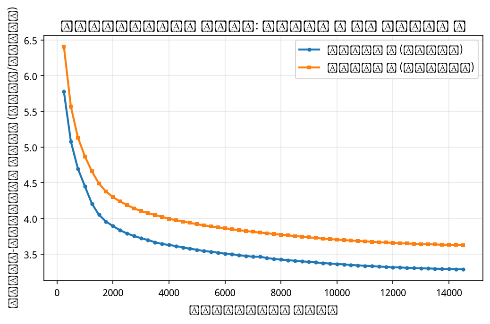
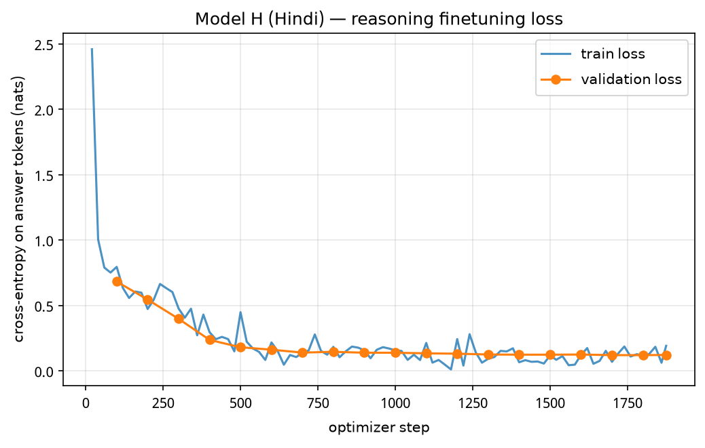
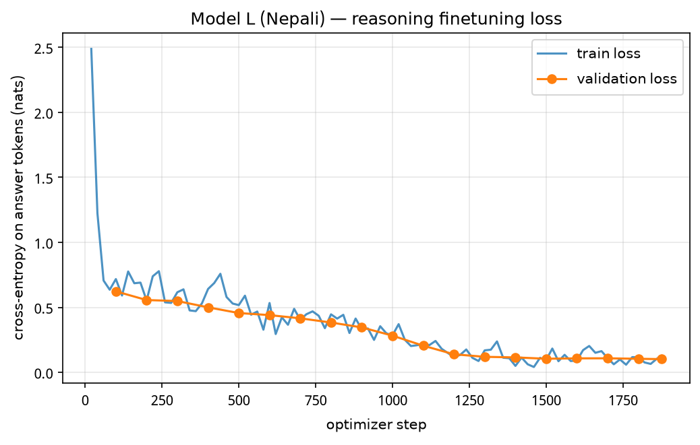
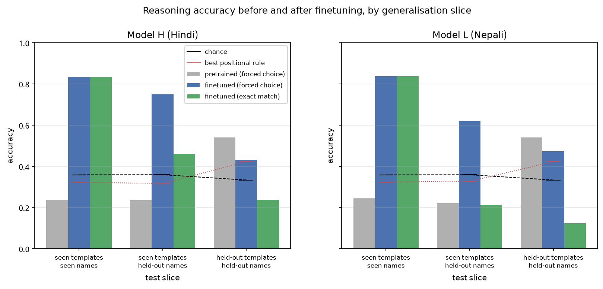
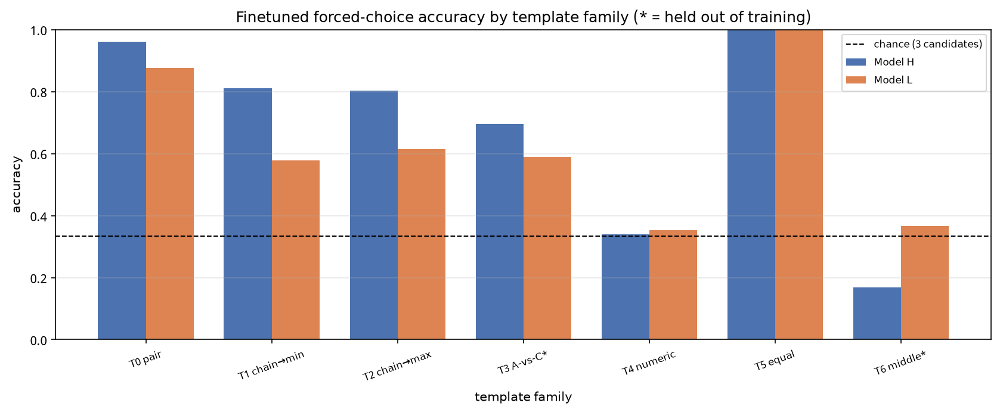
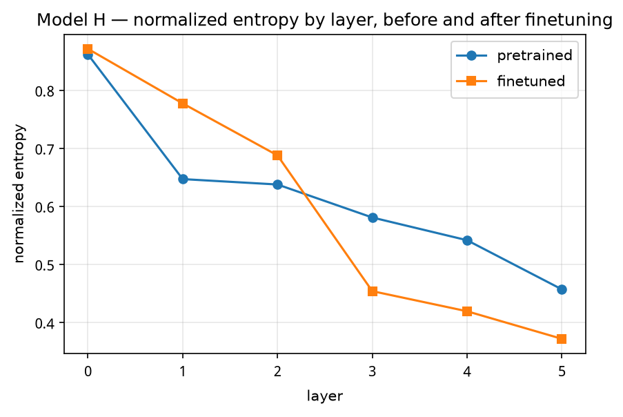
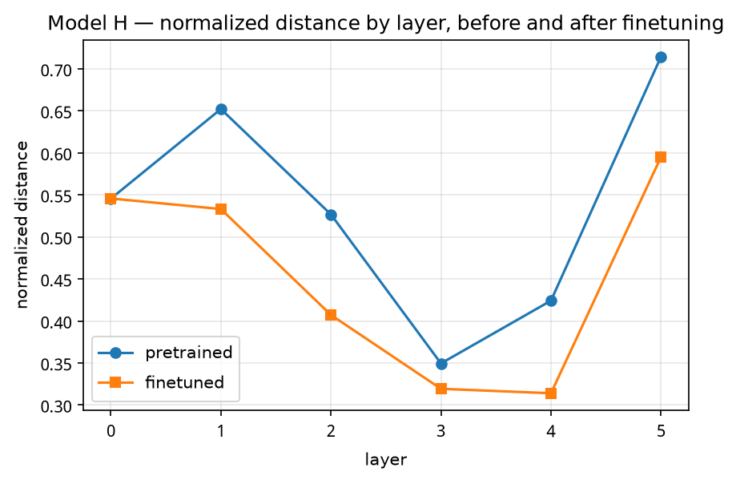
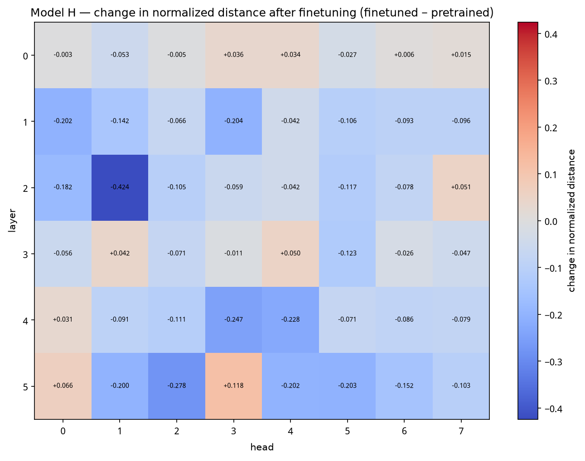
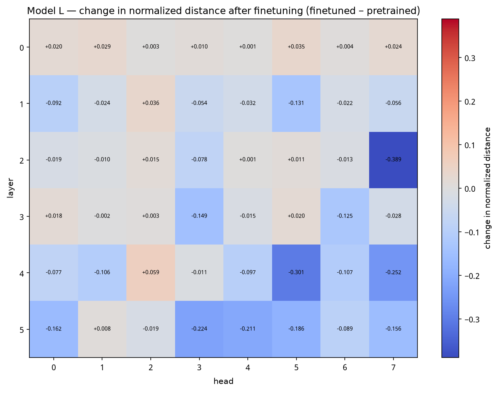

# Phase 3 — Reasoning Finetuning, Attention Analysis, and Final Report

**Model H = Hindi (`hi`)  ·  Model L = Nepali (`ne`)**

Each pretrained model is finetuned on a synthetic comparative-reasoning corpus in
its own language, scored before and after, and its attention re-measured on
reasoning prompts.

`report/phase1.md` and `report/phase2.md` remain the record of their phases. §1
below carries forward only the facts the Phase 3 conclusions actually depend on.

| Phase 3 result | Model H (Hindi) | Model L (Nepali) |
|---|---:|---:|
| Reasoning examples generated | 25,000 | 25,000 |
| Finetuning validation loss | 0.1208 | 0.1018 |
| **Seen patterns, seen names** | **83.4%** | **83.7%** |
| **Seen patterns, unseen names** | **75.0%** | **62.0%** |
| **Unseen patterns and names** | 43.2% | 47.4% |
| Pretrained baseline (forced choice) | 22–54% | 22–54% |
| Attention: mean distance change | −0.083 | −0.061 |
| Attention: sink-rate change | −0.113 | −0.112 |

**The three findings.** Stated comparison is solved — 100% on every word-based
family with familiar names. Numeric comparison never appeared — 31.7% and 30.8%
against a 33% chance floor, despite ~4,400 numeric training examples each. And
what was learned is *extremum selection*, not ordering: transitivity transfers to
an unseen question form (69.6% on T3) while naming the middle element of a chain
fails below chance (16.8% on T6).

**The cross-phase finding.** Phase 2 ended with perplexity and bits-per-byte
disagreeing about which model was better. Reasoning is an independent third
measurement and it sides with perplexity — on the slice that tests
generalisation, Model H leads 75.0% to 62.0% (§7.2).

Sources: `{lang}/eval/reasoning_{pretrained,finetuned}.json`,
`{lang}/eval/attention_ft_stats.json`, `{lang}/logs/finetune_log.csv`,
`{lang}/reasoning/stats.json`.

---

## 1. What Phase 3 starts from

Two pretrained decoder-only Transformers, one per language, built in Phases 1–2.
Only the facts below matter for what follows; the full accounts are in
[`phase1.md`](phase1.md) and [`phase2.md`](phase2.md).

| | Model H (Hindi) | Model L (Nepali) | Why it matters here |
|---|---:|---:|---|
| Trainable parameters | 24,285,184 | 24,285,184 | identical, so capacity is not a variable |
| Pretraining tokens | 475,136,000 | 475,136,000 | identical budget |
| Training tokens available | 479,808,984 | 487,001,673 | |
| Manual share of training tokens | 13.46% | 7.98% | H had 69% more curated in-domain text |
| **Tokenizer fertility** (tokens/word) | **1.4675** | **1.5881** | drives the §5.2(c) failure mode |
| Top-1000 token coverage | 72.52% | 62.67% | L's distribution is flatter |
| Test perplexity | **26.36** | **36.79** | says H is better |
| Bits per byte | **0.5448** | **0.5018** | says L is better |
| Vocabulary | 10,000 | 10,000 | unchanged during finetuning |

Three things carried forward that shape this phase:

**The two models are controlled against each other.** Same architecture, same
parameter count, same token budget, same hyperparameters, same seed — only the
corpus differs. That holds through finetuning too (§3.2), so every H-vs-L
difference reported here is attributable to the data.

**Phase 2 ended with an unresolved disagreement.** Perplexity ranks Model H
better by 40%; bits-per-byte ranks Model L better by 8%. Perplexity is per
*token* and a Nepali token carries 22% more bytes, so the two metrics are
measuring different things. Phase 2 could only conclude the narrow claim — that
the raw perplexity gap overstates the quality gap — and left open which metric
tracks actual capability. §7.2 settles it with a third measurement.

**The sequence format is inherited.** Pretraining packed documents as
`… doc </s> doc …` with **no BOS**, so token id 2 was never trained and its
embedding is still at initialisation. Finetuning examples are therefore
`prompt + " " + answer + </s>` with no BOS (§3.1).

**Architecture**, for reference: 6 layers × 512 d_model × 8 heads, d_ff 2048,
context 512, pre-norm, learned absolute positional embeddings, tied
input/output embeddings. Multi-head attention, positional embeddings and the
causal mask are written from PyTorch primitives in `model/gpt.py`, with
`F.scaled_dot_product_attention` deliberately unused — which is what makes the
attention analysis in §6 possible.



---

## 2. The reasoning dataset

Generated programmatically by `finetune/gen_reasoning.py`, so every label is
known by construction. No existing benchmark was downloaded.

### 2.1 Task families

Seven families per language, covering the three styles the brief names —
superlatives over a stated chain, comparison of given quantities, and multi-hop
chaining of inequalities.

| ID | Family | What it requires | In training? |
|---|---|---|---|
| T0 | Two-entity comparison, either pole asked | invert one relation | ✅ |
| T1 | Three-entity chain → smallest | chain two inequalities | ✅ |
| T2 | Three-entity chain → largest | chain two inequalities | ✅ |
| **T3** | **Chain, then "A vs C?" asked directly** | transitivity as a relation, not a superlative | ❌ **held out** |
| T4 | Three entities with numeric values → extreme | compare three magnitudes | ✅ |
| T5 | Two equal values | recognise that neither wins | ✅ |
| **T6** | **Three-entity chain → the middle one** | the full ordering, not an extreme | ❌ **held out** |

Examples as generated:

```
T2  राम, श्याम से लंबा है। श्याम, मोहन से लंबा है। सबसे लंबा कौन है?          → राम
T4  बैग का वजन 37 किलो है। गमला का वजन 5 किलो है। जूता का वजन 15 किलो है।
    सबसे हल्का कौन सा है?                                                    → गमला
T5  अनीता की उम्र 24 साल है। रेखा की उम्र 24 साल है। दोनों में छोटी कौन है?   → बराबर

T1  राम हरि भन्दा अग्लो छ। हरि कृष्ण भन्दा अग्लो छ। सबैभन्दा होचो को हो?      → कृष्ण
T3  अनुप निरज भन्दा कान्छो छ र निरज राजु भन्दा कान्छो छ।
    त्यसैले अनुप र राजु मध्ये कान्छो को हो?                                    → अनुप
```

Five comparison dimensions per language, each with a matching entity pool:
height and age for people, weight and price for objects, speed for vehicles.
Attaching महंगा to a person's name is not text anyone would write, and the brief
asks for natural phrasing rather than translated templates.

**Grammatical agreement is handled, and it is also a leakage control.** Hindi and
Nepali adjectives agree with their subject (लंबा/लंबी, अग्लो/अग्ली), the
interrogative differs by animacy (कौन vs कौन सा, को vs कुन), and the Hindi
possessive agrees with the dimension noun (की उम्र, का वजन). All entities in one
example therefore share grammatical gender — otherwise the adjective *in the
question* would identify which entity is the answer.

### 2.2 Size and template variety

| Split | Templates | Names | Hindi | Nepali |
|---|---|---|---:|---:|
| `train.jsonl` | T0,T1,T2,T4,T5 | training pool | 20,000 | 20,000 |
| `val.jsonl` | T0,T1,T2,T4,T5 | training pool | 2,000 | 2,000 |
| `test_iid.jsonl` | T0,T1,T2,T4,T5 | training pool | 1,000 | 1,000 |
| `test_names.jsonl` | T0,T1,T2,T4,T5 | **held-out pool** | 1,000 | 1,000 |
| `test_templates.jsonl` | **T3, T6** | **held-out pool** | 1,000 | 1,000 |

Training-set template mix (Hindi / Nepali): T0 3,027 / 2,969 · T1 5,120 / 5,003 ·
T2 4,975 / 4,952 · T4 4,418 / 4,663 · T5 2,460 / 2,413. Distinct prompts in
train: 19,414 (H) and 20,000 (L) — Hindi repeats some two-entity questions
because it splits its object and vehicle pools by grammatical gender, halving
the pool available to any single example. Mean encoded length 27.8 (H) and 26.8
(L) tokens, maximum 49 and 43. **Zero `<unk>` tokens in either corpus.**

Entity pools, disjoint between train and test: 24 people (12 m + 12 f) train /
16 test; 14 objects and 14 vehicles train / 10 each test.

### 2.3 Train–test leakage control

The brief asks for held-out entity names **or** held-out relation patterns. Both
are used, isolated into separate slices, because a single test number cannot
distinguish memorisation from generalisation:

- **`test_iid`** — seen patterns, seen names. The in-distribution ceiling.
- **`test_names`** — seen patterns, **names never seen in training**. The drop
  from `test_iid` isolates generalisation over entities.
- **`test_templates`** — **two question types never seen in training**, *and*
  held-out names. The drop from `test_names` isolates generalisation over the
  relation itself.

On top of that, every prompt string is blocked from every later split, so the
splits are disjoint by construction rather than by filtering afterwards.

### 2.4 Balance controls, and the floors they establish

An accuracy without a floor is not evidence. Three controls, all measured into
`{lang}/reasoning/stats.json`:

**Answer position.** A generator that always names the answer first makes the
task solvable by position alone. Premise *order* and premise *polarity* are both
randomised — a chain is stated as "A > B. B > C." or as "C < B. B < A." in either
order — and each example is then drawn against a round-robin target position.
Measured result: the best fixed-position rule scores 36.2–36.8% on the
in-pattern slices, against 33–36% chance.

**One structural exception, reported rather than hidden.** T6 asks for the middle
of a three-entity chain, and that entity is named in *both* premises — so it is
mentioned first or second, never last. No shuffling changes that. A fixed-position
rule therefore scores **42.3% (H) / 42.2% (L)** on `test_templates`. That is the
floor the §4 numbers for that slice must be read against, and it is why that
slice's headline figure looks weaker than it is.

**Answer identity.** No single name is the answer disproportionately often within
the gender group it competes in.

### 2.5 Digit script — measured, not assumed

T4 and T5 contain numerals, and which script to write them in is an empirical
question about each corpus. `finetune/gen_reasoning.py --digit-audit` counts
digit characters across the whole of each language's `train.bin`:

| | ASCII digit characters | Devanagari digit characters | Devanagari share | Used |
|---|---:|---:|---:|---|
| Hindi | 17,525,334 | 637,759 | 3.51% | `24` |
| Nepali | 1,470,224 | 16,980,713 | **92.03%** | `२४` |

Writing `२४` into Hindi questions, or `24` into Nepali ones, would have made the
numeric family fail for a tokenisation reason with nothing to do with reasoning.

---

## 3. Finetuning

### 3.1 Protocol

Each model starts from **its own** pretrained checkpoint and is trained only on
**its own** language's reasoning corpus. The architecture is read out of the
checkpoint rather than re-specified, so a run cannot disagree with the weights
it is loading.

**The tokenizer and vocabulary are unchanged.** No token was added, no embedding
resized. The prompt/answer boundary is an *index into the target tensor*, not a
special token — which is what keeps the vocabulary byte-identical to Phase 1's.

**Loss is computed on the answer only.** For a sequence
`[p₀…p_{P-1}, a₀…a_{A-1}, </s>]`, inputs are `ids[:-1]` and targets `ids[1:]`, so
target position *i* is the prediction made *from* input position *i*. The first
answer token sits at index *P* and is predicted from *P−1*; targets `[0 : P−1]`
are set to `-100` and the rest kept. Exactly `len(answer) + 1` positions are
supervised — the `+1` is `</s>`, because the model must also learn to stop.
Masking to `P` instead would discard the single most important prediction in the
example, and the loss curve would look identical either way.

**No BOS.** Pretraining packed documents as `… doc </s> doc …` with no BOS, so
token id 2 was never trained and its embedding is still at initialisation.
Finetuning examples are `prompt + " " + answer + </s>`.

**Prompt and answer are encoded separately** and concatenated —
`sp.encode(prompt) + sp.encode(answer)`, never `sp.encode(prompt + " " + answer)`.
The two are not guaranteed to agree at the boundary: SentencePiece could merge
the last prompt token with the first answer token into a piece that generation,
which only ever receives the prompt, can never produce. `encode_prompt()` is the
single function both training and evaluation call, so the training prefix and the
generation prompt are identical by construction.

Checkpoints are saved in Phase 2's format unchanged — `train/checkpoint.py` is
imported verbatim — so they carry model weights, optimizer state, scheduler
state, training step and configuration, plus the RNG and data-stream state that
make a resumed run identical rather than merely similar.

### 3.2 Hyperparameters — identical for both models

`hindi/configs/hi_ft.yaml` and `nepali/configs/ne_ft.yaml` differ only in the
three paths and the language code.

| Setting | Value | Reason |
|---|---|---|
| Initialised from | that language's `ckpt_final.pt` | brief: start from own pretrained checkpoint |
| Tokenizer / vocabulary | frozen, from Phase 1 | brief: unchanged during finetuning |
| Optimizer | AdamW, β = (0.9, 0.95), eps 1e-8 | same as pretraining |
| Peak learning rate | **1e-4** | a sixth of pretraining's 6e-4: adapt the model, do not overwrite it |
| Schedule | 100-step warmup → cosine → 1e-5 | the run is 8× shorter than pretraining |
| Optimizer state | **fresh, not inherited** | AdamW's second moments from a 6e-4 cosine run would size the first updates for a schedule that is no longer running |
| Weight decay | 0.1 on ≥2-D tensors | same rule as pretraining |
| Gradient clipping | 1.0 global norm | same |
| Batch | 32 examples, no accumulation | ~900 tokens per batch |
| Epochs | 3 → 1,875 optimizer steps | |
| Dropout | 0.1 / 0.1, unchanged | changing it mid-project would confound the comparison |
| Seed | 1337 | same as pretraining |

### 3.3 Training result




| | Model H | Model L |
|---|---:|---:|
| Validation loss, step 100 → 1,875 | 0.6817 → **0.1208** | 0.6231 → **0.1018** |
| Validation perplexity, final | 1.128 | 1.107 |
| Answer-token accuracy, step 100 → 1,875 | 76.1% → **94.0%** | 78.1% → **94.7%** |
| Tokens seen | 1,605,132 | 1,548,897 |
| Supervised positions seen | 158,409 | 165,150 |
| Wall clock | 82.7 min | 68.5 min |

Both runs completed all three epochs. Loss fell by more than an order of
magnitude and final validation perplexity of ~1.1 means the model is near-certain
about the answer tokens.

Two checks worth recording. The step-20 loss of ~2.46 (H) and ~2.49 (L) — not
~9.2, which is `ln 10000` — rules out the model predicting from an untrained
embedding, i.e. confirms no BOS crept in. And `supervised_seen` of ~158k is
exactly 20,000 examples × ~2.6 answer tokens × 3 epochs, confirming the loss was
applied to answer tokens only rather than to whole sequences.

**Compute note.** These runs used a CPU-only PyTorch build
(`torch 2.13.0+cpu`), which is why the wall clock is ~75 minutes rather than the
~10 a T4 would take. The computation and the resulting weights are unaffected.

**Answer-token accuracy is a training signal, not a result.** It is
teacher-forced and measured on `val.jsonl`, which reuses training question types
and training names. It says the optimisation worked. §4 is what says whether the
model can reason.

---

## 4. Reasoning results

### 4.1 Two scoring protocols, and why both are needed

**Exact match** — prompt the model, decode greedily to at most 8 tokens, stop at
`</s>`, compare against the gold answer after Unicode NFC normalisation. This is
the metric the brief names.

**Forced choice** — score each candidate answer as a continuation of the same
prompt and take the highest log-likelihood.

The second exists because of a measurement problem in the first. A *pretrained*
model asked *"सबसे छोटा कौन है?"* does not answer at all — it continues the text
as prose. Exact match scores it **0.0% on every slice**, so a report of
"0% → 83%" would credit a gain in *output formatting* as a gain in reasoning.
Forced choice asks the narrower, fairer question — can the model order the
entities at all — independently of whether it has learned the answer format.
Both are reported, labelled.

**NFC normalisation is not optional here.** SentencePiece normalises its input,
and several Devanagari nukta letters — `ड़` in घड़ी, `ज़` in तेज़ — are on
Unicode's composition-exclusion list, so a decode round-trip returns them
decomposed as base + U+093C. Canonically the same string, different bytes. A
byte comparison would mark correct answers wrong on exactly the entities whose
names carry a nukta.

### 4.2 Headline results



**Model H (Hindi)**

| Slice | Pretrained exact | Pretrained forced-choice | **Finetuned exact** | **Finetuned forced-choice** | chance | best positional |
|---|---:|---:|---:|---:|---:|---:|
| `test_iid` — seen patterns, seen names | 0.0% | 23.7% | **83.4%** | **83.4%** | 35.8% | 32.3% |
| `test_names` — seen patterns, unseen names | 0.0% | 23.6% | **46.0%** | **75.0%** | 35.9% | 31.6% |
| `test_templates` — unseen patterns and names | 0.0% | 54.0% | 23.7% | 43.2% | 33.3% | **42.3%** |

**Model L (Nepali)**

| Slice | Pretrained exact | Pretrained forced-choice | **Finetuned exact** | **Finetuned forced-choice** | chance | best positional |
|---|---:|---:|---:|---:|---:|---:|
| `test_iid` | 0.0% | 24.5% | **83.7%** | **83.7%** | 35.8% | 32.4% |
| `test_names` | 0.0% | 22.1% | **21.4%** | **62.0%** | 35.9% | 32.7% |
| `test_templates` | 0.0% | 54.1% | 12.4% | 47.4% | 33.3% | **42.2%** |

Two features of the *pretrained* rows need explaining, because both look wrong
at first glance.

**Below chance on the easy slices** (23.7% and 24.5% against 35.8%). That is not
noise — an untrained model guessing would land near chance. Scoring consistently
*below* it means the pretrained model has a systematic preference for the wrong
candidate, most plausibly favouring the most recently mentioned entity, which for
T1 and T2 is usually wrong.

**54% on the hardest slice**, above both chance and the positional floor. This is
an artifact, not reasoning: T3 names two of the three entities *in the question
itself*, so a model that merely prefers a recently-named entity picks between the
right two and gets ~50% for free. It is exactly why per-slice and per-template
breakdowns matter — an aggregate would have hidden it.

### 4.3 Per-template breakdown



Finetuned models. `*` marks a family held out of training entirely.

| Family | H exact | H forced | L exact | L forced |
|---|---:|---:|---:|---:|
| T0 pair, seen names | 100.0% | 100.0% | 100.0% | 100.0% |
| T1 chain → smallest | 100.0% | 100.0% | 99.6% | 99.6% |
| T2 chain → largest | 100.0% | 100.0% | 100.0% | 100.0% |
| T5 equality | 100.0% | 100.0% | 100.0% | 100.0% |
| **T4 numeric** | **31.7%** | **31.7%** | **30.8%** | **30.8%** |
| T0 pair, *unseen names* | 59.4% | 96.1% | 24.7% | 87.7% |
| T1 chain, *unseen names* | 47.7% | 81.0% | 12.4% | 57.8% |
| T2 chain, *unseen names* | 48.5% | 80.4% | 18.6% | 61.5% |
| T4 numeric, *unseen names* | 0.9% | 33.9% | 0.0% | 35.4% |
| T5 equality, *unseen names* | 100.0% | 100.0% | 100.0% | 100.0% |
| **T3\* transitive, A-vs-C** | **45.6%** | **69.6%** | **17.2%** | **58.9%** |
| **T6\* middle element** | 1.8% | **16.8%** | 7.9% | 36.7% |

### 4.4 What the numbers say

Four findings, in order of how much they change the picture.

**1. Stated comparison is solved.** T0, T1, T2 and T5 are at 100% on familiar
names for both languages. The 83.4% headline on `test_iid` is entirely dragged
down by one family.

**2. Numeric comparison never appeared.** T4 sits at 31.7% and 30.8% — that is
chance. Both models saw ~4,400 numeric examples in training and learned nothing
transferable from them. They can chain *stated* relations but cannot compare
*magnitudes*. This is expected for 24M parameters — a numeral is split into
subword pieces that carry no ordinal information — but it was measured rather
than assumed, and it is the clearest capability boundary in the project.

**3. Transitivity generalises to an unseen phrasing.** T3 was never shown during
training, and Hindi answers it correctly 69.6% of the time against a 33% chance
floor. That is the single strongest piece of evidence here: the model is applying
a relation it learned as a superlative to a question form it has not seen.

**4. But the full ordering was never learned — only extremum selection.** T6 asks
for the middle entity, and Hindi scores **16.8%, below chance**. Below-chance is
stronger evidence than chance would be: the model is not guessing, it is
confidently picking a biggest-or-smallest every time, which is always wrong for
T6. It learned "the answer is an extreme", which is true of every training family
and false for T6.

So: relational reasoning transfers, magnitude reasoning never appeared, and what
was learned is extremum selection rather than ordering.

---

## 5. Qualitative analysis

Every example below is drawn from the committed
`{lang}/eval/reasoning_samples_*.jsonl`.

### 5.1 Successes

**Transitivity on an unseen question form** (T3, held out). The model has only
ever been asked "who is the most X"; here it is asked to relate two specific
entities, and it chains correctly.

> **H:** नौका, कार से धीमी है और रेलगाड़ी, नौका से धीमी है। तो कार और रेलगाड़ी में तेज़ कौन सी है?
> — gold **कार**, generated **कार** ✓
>
> **L:** दिपेश निरज भन्दा जेठो छ र बिकास दिपेश भन्दा जेठो छ। त्यसैले निरज र बिकास मध्ये कान्छो को हो?
> — gold **निरज**, generated **निरज** ✓

Note the second one also inverts: premises are stated with जेठो (elder), the
question asks कान्छो (younger).

**Double inversion with unseen names.**

> **H:** ज्योति, वंदना से लंबी है और वंदना, किरण से लंबी है। तो किरण और ज्योति में छोटी कौन है?
> — gold **किरण**, generated **किरण** ✓

**The equality case**, at 100% across every slice including unseen names — the
model correctly declines to name an entity when neither wins.

### 5.2 Failures, with diagnosis

**(a) Format failure before finetuning.** The reason exact match alone is
misleading:

> **H:** अमित, श्याम से बड़ा है। दोनों में बड़ा कौन है?
> — gold **अमित**, generated *"दोनों के बीच में एक-दूसरे का"*
>
> **L:** शान्ति गीता भन्दा होची छिन्। गीता मीना भन्दा होची छिन्। सबैभन्दा होची को हुन्?
> — gold **शान्ति**, generated *"गीता भन्दा होची। गीता"*

The pretrained model is not failing to compare — it is continuing the text,
because that is the only thing it was ever trained to do.

**(b) The middle-element collapse** (T6). Diagnosed in §4.4: the model has learned
that answers are extremes.

> **H:** पंकज, मनीष से छोटा है। मनीष, आशीष से छोटा है। बीच में कौन है?
> — gold **मनीष**, generated **आशीष** — it named the largest
>
> **L:** अनुप सुजन भन्दा होचो छ। सुजन प्रदीप भन्दा होचो छ। बीचमा को हो?
> — gold **सुजन**, generated **अनुप** — it named the smallest

**(c) Knows the answer, cannot spell it.** The gap between exact match and forced
choice on `test_names` — 46.0% vs 75.0% for Hindi, 21.4% vs 62.0% for Nepali —
is almost entirely this. The model ranks the correct unseen name highest, then
generates a *training* name instead:

> **H:** अंजलि, पूजा से छोटी है। ज्योति, अंजलि से छोटी है। सबसे छोटी कौन है?
> — gold **ज्योति**, ranked correctly, generated **अनीता** (a training name)
>
> **L:** मन्जु निर्मला भन्दा जेठी छिन्। निर्मला अस्मिता भन्दा जेठी छिन्। सबैभन्दा जेठी को हुन्?
> — gold **मन्जु**, ranked correctly, generated **मता** (not a word)

Nepali's version is worse and the reason is tokenisation. Its fertility is 1.5881
against Hindi's 1.4675, so an unfamiliar name is split into more pieces, and
every piece is another chance to drift. `मता` is a fragment — the model lost the
thread mid-name. This is the clearest place in the project where a Phase 1
tokenizer property shows up directly as a Phase 3 capability difference.

**(d) Numeric comparison.** Chance-level, both languages.

> **H:** बैग का वजन 37 किलो है। गमला का वजन 5 किलो है। जूता का वजन 15 किलो है। सबसे हल्का कौन सा है?
> — gold **गमला** (5), generated **जूता** (15)
>
> **L:** रामको उमेर ६२ वर्ष छ। हरिको उमेर ३४ वर्ष छ। कृष्णको उमेर ६९ वर्ष छ। सबैभन्दा कान्छो को हो?
> — gold **हरि** (34), generated **कृष्ण** (69) — it named the *oldest* when asked for the youngest

---

## 6. Attention: pretrained vs finetuned

Measured with the Phase 2 toolkit unchanged — `capture_attention` and
`attention_stats_over_sequences` — on **64 reasoning prompts drawn from
`test_templates`**, which are unseen by both checkpoints. The same sequences go
through both models, so any difference is a difference in the models and not in
their familiarity with the text.

> **These numbers are not comparable to `phase2.md` §3.** Phase 2 measured on 64
> random 256-token windows of corpus text; this measures on ~30-token reasoning
> prompts, and the entropy normalisation is per position, so short sequences
> weight early positions much more heavily. Only the pretrained-vs-finetuned
> delta *within this section* is meaningful.

### 6.1 Layer-wise profile




| Layer | H entropy pre → ft | H distance pre → ft | L entropy pre → ft | L distance pre → ft |
|---|---|---|---|---|
| 0 | 0.862 → 0.871 | 0.546 → 0.546 | 0.879 → 0.872 | 0.538 → 0.554 |
| 1 | 0.647 → 0.777 | 0.652 → 0.533 | 0.684 → 0.775 | 0.618 → 0.571 |
| 2 | 0.637 → 0.688 | 0.527 → 0.407 | 0.677 → 0.714 | 0.498 → 0.437 |
| 3 | 0.580 → 0.453 | 0.350 → 0.319 | 0.531 → 0.527 | 0.384 → 0.349 |
| 4 | 0.541 → 0.419 | 0.424 → 0.314 | 0.512 → 0.492 | 0.474 → 0.363 |
| 5 | 0.457 → 0.371 | 0.715 → 0.595 | 0.491 → 0.503 | 0.676 → 0.547 |

### 6.2 Overall change

| Statistic | H pre → ft | Δ | L pre → ft | Δ |
|---|---|---:|---|---:|
| Normalised entropy | 0.621 → 0.597 | −0.024 | 0.629 → 0.647 | +0.018 |
| **Normalised distance** | 0.536 → 0.453 | **−0.083** | 0.531 → 0.470 | **−0.061** |
| Previous-token rate | 0.175 → 0.169 | −0.006 | 0.182 → 0.173 | −0.009 |
| **Sink rate** | 0.350 → 0.237 | **−0.113** | 0.339 → 0.227 | **−0.112** |




### 6.3 What changed

**Attention became more local, in both models.** Mean normalised distance fell at
every layer for Hindi and at five of six for Nepali — −0.083 and −0.061 overall.
This is the opposite of the hypothesis stated before the run, which was that
reasoning prompts might *lengthen* attention as heads learned to look back at the
entities being compared. They did not. A reasoning prompt is short and densely
structured, and what the model appears to have learned is to attend to the
locally relevant clause rather than to range over the context.

**The attention sinks weakened sharply.** Sink rate — the share of attention
dumped on position 0 — fell by 0.113 (H) and 0.112 (L), a ~33% relative drop, and
the head taxonomy moves with it: Hindi goes from 24 sink heads to 12, Nepali from
21 to 9, with content-based heads rising from 22 to 30 and 24 to 35. A sink is
what a head does when it has nothing useful to attend to; on this task, many
heads found something to do.

**The largest single change is the same head type in both models.** Hindi's layer
2 head 1 and Nepali's layer 2 head 7 both show the largest shift on all three
statistics — entropy +0.377 / +0.376, distance −0.424 / −0.389, sink rate −0.547
/ −0.571. A layer-2 head in each model converted from a narrow sink into a
broader, more local, content-driven head. That the two models independently made
the same structural change at the same depth is the most striking result in this
section.

**Where the two differ.** Hindi's late layers sharpened (entropy 0.457 → 0.371 at
layer 5) while Nepali's stayed flat or loosened slightly (0.491 → 0.503), giving
opposite signs on overall entropy: −0.024 against +0.018.

**How far to push this.** The distance and sink changes are large and consistent
across both models and so are worth reporting. The entropy difference between the
two models is 0.04 in absolute terms, on **one training run per language**, with
head classification using heuristic thresholds. It is an observation, not a
conclusion.

---

## 7. Model H versus Model L — the four required questions

### 7.1 How did data scale and quality differ?

| Factor | Hindi | Nepali | Direction |
|---|---:|---:|---|
| Cleaned corpus available | 1,051M words | 709M words | H had 48% more to select from |
| Downsampling keep rate | 37.32% | 53.75% | H could afford to be more selective |
| Manual share of training tokens | 13.46% | 7.98% | H had 69% more curated in-domain text |
| Top-1000 token coverage | 72.52% | 62.67% | L's token distribution is flatter |
| Tokenizer fertility | 1.4675 | 1.5881 | L spends 8% more tokens per word |
| Characters per token | 3.4715 | 3.9520 | L's tokens cover more text |

Nepali is the lower-resource language by every measure, and the shortfall
compounds: less text available → less aggressive downsampling possible → a
smaller manual share → a flatter token distribution.

### 7.2 How do language-modelling and reasoning results compare across the tiers?

This is the question Phase 2 could not settle. It left two metrics pointing in
opposite directions:

| | Model H | Model L | Which is better? |
|---|---:|---:|---|
| Test perplexity | 26.36 | 36.79 | **H**, by 40% |
| Bits per byte | 0.5448 | 0.5018 | **L**, by 8% |
| chrF++ | 19.90 | 18.35 | **H**, by 8% |

Reasoning is a third, independent measurement:

| | Model H | Model L | Which is better? |
|---|---:|---:|---|
| `test_iid` (forced choice) | 83.4% | 83.7% | tied |
| **`test_names` (forced choice)** | **75.0%** | **62.0%** | **H**, by 13 points |
| `test_names` (exact match) | 46.0% | 21.4% | **H**, by 25 points |
| T3 transitive, held out | 69.6% | 58.9% | **H**, by 11 points |
| `test_templates` (forced choice) | 43.2% | 47.4% | L, by 4 points — but both near the 42% floor |

**The answer: reasoning sides with perplexity, not with bits-per-byte.**

The tie on `test_iid` is the important control. Both models learn the task to
the same standard — 83.4% against 83.7% — so raw learning capacity is
indistinguishable. The gap appears precisely when the task requires
**generalisation to unfamiliar input**, which is what a resource advantage
should buy. And it appears largest on exact match (46.0% vs 21.4%), where the
model must *produce* an unfamiliar name rather than merely rank it.

The apparent Nepali win on `test_templates` should not be read as one: 47.4%
against a 42.2% positional floor is 5 points of signal, while Hindi's 43.2%
against 42.3% is under 1. Both models are close to the floor on that slice, and
the family driving Nepali's number is T6 (36.7% vs Hindi's 16.8%) — where Hindi
is *below* chance because it has more confidently learned the extremum heuristic.
Nepali looks better there by being less committed to a wrong rule.

So bits-per-byte was measuring something real — Model L does compress its own
language slightly better per byte — but it was not measuring the capability that
transfers to a downstream task.

### 7.3 What tokenizer / corpus factors most affected the lower-resource model?

**Fertility, and it is visible directly in the error analysis.** Nepali's 1.5881
tokens per word against Hindi's 1.4675 means an unfamiliar entity name is split
into more pieces. The consequence is §5.2(c): on unseen names, both models rank
the correct answer well (75.0% vs 62.0%) but Nepali collapses when asked to
*write* it (21.4% vs 46.0%), producing fragments like `मता`. Each extra piece is
another opportunity to drift.

**The flatter token distribution.** Top-1000 coverage of 62.67% against 72.52%
means Nepali's probability mass is spread over more tokens, so every next-token
decision is made with less concentration. The same property showed up in Phase 2
as Model L peaking at a higher generation temperature (1.0 vs 0.5).

**Not UNK, and not vocabulary size.** Both corpora have UNK rates of ~5 × 10⁻⁶
and both vocabularies are 10,000. Those were ruled out rather than assumed.

**Corpus size and manual share are confounded with fertility** and this
experiment does not separate them — see §8.

### 7.4 What evidence explains the observed differences?

| Claim | Evidence |
|---|---|
| Both models learned the task equally well | `test_iid` forced choice 83.4% vs 83.7% (§4.2); finetuning val loss 0.121 vs 0.102 (§3.3) |
| H generalises better over entities | `test_names` 75.0% vs 62.0% forced, 46.0% vs 21.4% exact (§4.2) |
| That gap is driven by tokenizer fertility | 1.5881 vs 1.4675 (§1); the rank-right / spell-wrong failures in §5.2(c) |
| Neither model learned magnitude comparison | T4 at 31.7% / 30.8% against 33% chance (§4.3) |
| Both learned extremum selection, not ordering | T6 at 16.8% / 36.7%, Hindi below chance (§4.3, §5.2(b)) |
| Transitivity transferred to an unseen form | T3 at 69.6% / 58.9% against 33% chance (§4.3, §5.1) |
| The pretrained baseline is a format failure, not a reasoning failure | exact 0.0% everywhere but forced choice 22–54% (§4.2); samples in §5.2(a) |
| Finetuning made attention more local and less sink-dependent | distance −0.083 / −0.061, sink −0.113 / −0.112 (§6.2) |
| The accuracy numbers are not positional artifacts | best fixed-position rule 31.6–36.8% on in-pattern slices (§2.4) |

---

## 8. Limitations

**The manual-data requirement was not met** (a Phase 1 shortfall carried forward;
see [`phase1.md`](phase1.md) §7). 13.46% (H) and 7.98% (L) against the brief's 20%. All manual data collected was used and the downloaded side was
downsampled as far as the token target allowed; Nepali had no more manually
collectable text available. Its effect on these results is not isolated by any
measurement here.

**n = 1 per language.** One pretraining run and one finetuning run each. Every
H-vs-L difference in §7 is a real measurement with no error bars. Nothing here
separates a language effect from run-to-run variance — including the attention
differences in §6.

**Corpus size, manual share and fertility are confounded.** Nepali has less text
*and* less curated text *and* a higher-fertility tokenizer. The error analysis in
§5.2(c) points at fertility as the proximate cause of the exact-match gap, but a
clean test would hold fertility constant, which two independently-trained
tokenizers cannot do.

**The reasoning task is narrow.** Seven template families over five dimensions.
"The model can reason" is not a claim this dataset can support; "the model
chains stated inequalities and fails at magnitudes" is.

**T6 carries a structural confound.** In a three-entity chain the middle entity
is necessarily named in both premises, so "the entity mentioned twice" identifies
it without any ordering. T6 is held out of training so the models cannot have
learned that shortcut here, but a *high* T6 score would not have proved ordering.
As it happens both scored low, so the point is moot.

**Attention head classification uses heuristic thresholds** (`classify_head`),
suitable for the qualitative discussion in §6.3 but not a formal test. The
taxonomy counts are informative because the *same* thresholds are applied before
and after, not because the labels are exact.

**The optional no-positional-embedding ablation was not run.**

---

## 9. Reproduction

Every number, table and figure in this report is regenerable from the committed
code and data. Commands, Google Drive links and environment setup are in the
[README](../README.md); nothing needed to reproduce this report is documented
only here.
